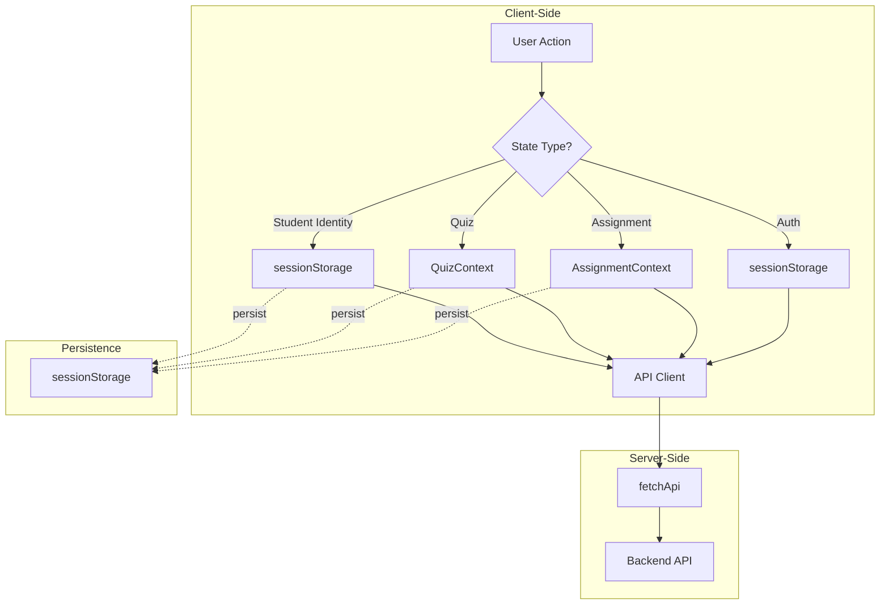

# Shiksha Sathi Frontend State Management

## Overview

The Next.js 16 frontend uses a **sessionStorage-only state management** approach:

1. **React Context** - For UI/feature state (assignments, quizzes)
2. **sessionStorage** - For all persistent data (auth tokens, assignment selection, quiz selection, student identity)
3. **Client Components** - All pages that need auth data are client components

---

## Authentication State

### Token Storage Strategy

```
┌─────────────────────────────────────────────────────────────┐
│  Request Context                                           │
├─────────────────────────────────────────────────────────────┤
│  Client (CSR)    →  sessionStorage (tab-isolated)        │
└─────────────────────────────────────────────────────────────┘
```

**Why sessionStorage for auth?**
- Provides **tab isolation** - logging out in one tab won't log out others
- Enables multi-role testing (teacher + student in different tabs)
- Uses `shiksha-sathi-token` key
- All pages that need auth are client components

### Code: `src/lib/api/client.ts`

```typescript
async function fetchApi<T>(
  path: string,
  options: RequestInit = {}
): Promise<T> {
  let token: string | undefined;
  
  if (typeof window !== 'undefined') {
    token = sessionStorage.getItem('shiksha-sathi-token') ?? undefined;
  }
  
  const headers = new Headers(options.headers);
  if (token) {
    headers.set('Authorization', `Bearer ${token}`);
  }
  // ...
}
```

---

## Feature Contexts

### AssignmentContext

Manages selected questions when creating assignments.

| Storage Key | `shiksha-sathi-assignment-questions` |
|------------|-----------------------------------|
| Storage Type | sessionStorage |
| Persistence | Tab-isolated |

```typescript
// Source: src/components/AssignmentContext.tsx
interface AssignmentContextType {
  selectedQuestions: Question[];
  toggleQuestion: (question: Question) => void;
  removeQuestion: (questionId: string) => void;
  clearSelection: () => void;
  isSelected: (questionId: string) => boolean;
  updateQuestionPoints: (questionId: string, newPoints: number) => void;
}
```

**Usage:**
```typescript
import { useAssignment } from "@/components/AssignmentContext";

function MyComponent() {
  const { selectedQuestions, toggleQuestion, clearSelection } = useAssignment();
  // ...
}
```

### QuizContext

Manages selected questions when creating quizzes.

| Storage Key | `shiksha-sathi-quiz-questions` |
|------------|-------------------------------|
| Storage Type | sessionStorage |
| Persistence | Tab-isolated |

```typescript
// Source: src/components/QuizContext.tsx
interface QuizContextType {
  selectedQuestions: Question[];
  toggleQuestion: (question: Question) => void;
  removeQuestion: (questionId: string) => void;
  clearSelection: () => void;
  isSelected: (questionId: string) => boolean;
}
```

---

## Student Identity Persistence

Student identity (for later quiz attempts) uses sessionStorage for tab isolation.

### Code: `src/lib/api/students.ts`

```typescript
const STORAGE_KEY = "shiksha-sathi-student-identity";

export function saveStudentIdentity(identity: StudentIdentity) {
  sessionStorage.setItem(STORAGE_KEY, JSON.stringify(identity));
}

export function loadStudentIdentity(): StudentIdentity | null {
  const stored = sessionStorage.getItem(STORAGE_KEY);
  return stored ? JSON.parse(stored) : null;
}

export function clearStudentIdentity() {
  sessionStorage.removeItem(STORAGE_KEY);
}
```

---

## State Flow Diagram



---

## Storage Keys Summary

| Key | Type | Purpose | Persistence |
|-----|------|---------|-------------|
| `shiksha-sathi-token` | sessionStorage | Auth token | Tab-isolated |
| `shiksha-sathi-assignment-questions` | sessionStorage | Selected assignment questions | Tab-isolated |
| `shiksha-sathi-quiz-questions` | sessionStorage | Selected quiz questions | Tab-isolated |
| `shiksha-sathi-student-identity` | sessionStorage | Student identity | Tab-isolated |

---

## Best Practices

### 1. Use sessionStorage for all auth and state
```typescript
// ✅ Good - sessionStorage is tab-isolated
sessionStorage.setItem("shiksha-sathi-token", token);
```

### 2. Clear storage on logout
```typescript
// When logging out
sessionStorage.removeItem("shiksha-sathi-token");
sessionStorage.removeItem("shiksha-sathi-student-identity");
```

### 3. Handle SSR hydration
```typescript
// Always check for window before accessing browser storage
if (typeof window !== "undefined") {
  const data = sessionStorage.getItem(key);
}
```

### 4. Use Context for shared UI state
```typescript
// For components that need to share state
import { createContext } from "react";
import { useContext, useState } from "react";
```

### 5. Client components for auth-dependent pages
```typescript
// Pages that need auth data should be client components
"use client";

import { useEffect, useState } from "react";

export default function MyPage() {
  const [data, setData] = useState(null);
  
  useEffect(() => {
    // Fetch auth-dependent data here
    api.auth.getMe().then(setData);
  }, []);
}
```

---

## API Client Usage

```typescript
import { fetchApi } from "@/lib/api/client";

// GET request
const users = await fetchApi<User[]>("/users");

// POST request
const newUser = await fetchApi<User>("/users", {
  method: "POST",
  body: JSON.stringify(userData),
});

// With error handling
try {
  const data = await fetchApi<Data>("/endpoint");
} catch (error) {
  if (error.status === 401) {
    // Handle unauthorized
  }
}
```

---

## Related Files

| File | Purpose |
|------|---------|
| `src/lib/api/client.ts` | API client with token handling |
| `src/components/AssignmentContext.tsx` | Assignment selection state |
| `src/components/QuizContext.tsx` | Quiz selection state |
| `src/lib/api/auth.ts` | Auth API functions |
| `src/lib/api/students.ts` | Student identity helpers |
| `src/lib/api/types.ts` | TypeScript types |
| `src/middleware.ts` | Route protection middleware |
| `src/components/AuthSessionGuard.tsx` | Client-side auth validation |
