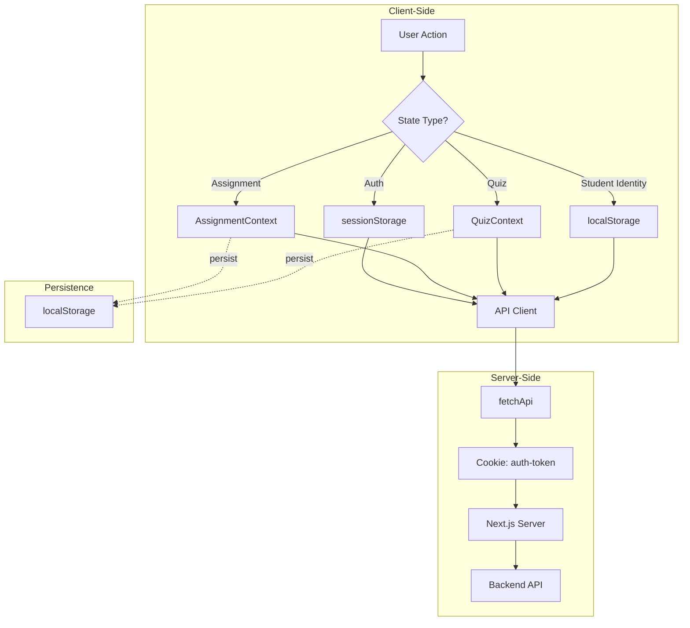

# Shiksha Sathi Frontend State Management

## Overview

The Next.js 16 frontend uses a **hybrid state management** approach:

1. **React Context** - For UI/feature state (assignments, quizzes)
2. **localStorage** - For persistent cross-session data
3. **sessionStorage** - For tab-isolated auth tokens
4. **Server Components** - For initial data fetching via cookies

---

## Authentication State

### Token Storage Strategy

```
┌─────────────────────────────────────────────────────────────┐
│  Request Context                                           │
├─────────────────────────────────────────────────────────────┤
│  Server (SSR)    →  Cookies (auth-token)                  │
│  Client (CSR)    →  sessionStorage (tab-isolated)        │
└─────────────────────────────────────────────────────────────┘
```

**Why sessionStorage for auth?**
- Provides **tab isolation** - logging out in one tab won't log out others
- Enables multi-role testing (teacher + student in different tabs)
- Uses `shiksha-sathi-token` key

### Code: `src/lib/api/client.ts`

```typescript
async function fetchApi<T>(
  path: string,
  options: RequestInit = {}
): Promise<T> {
  let token: string | undefined;
    
  if (typeof window === 'undefined') {
    // Server-side: read from cookie using dynamic import of next/headers
    token = await getServerToken();
  } else {
    // Client-side: read from sessionStorage for tab isolation
    token = sessionStorage.getItem('shiksha-sathi-token') ?? undefined;
  }
    
  const headers = new Headers(options.headers);
  if (token) {
    headers.set('Authorization', `Bearer ${token}`);
  }
  // ...
}
```

### Server Token Helper

```typescript
async function getServerToken(): Promise<string | undefined> {
  try {
    const { cookies } = await import('next/headers');
    const cookieStore = await cookies();
    return cookieStore.get('auth-token')?.value;
  } catch {
    return undefined;
  }
}
```

---

## Feature Contexts

### AssignmentContext

Manages selected questions when creating assignments.

| Storage Key | `shiksha-sathi-assignment-questions` |
|------------|-----------------------------------|
| Storage Type | localStorage |
| Persistence | Until manually cleared |

```typescript
// Source: src/components/AssignmentContext.tsx
interface AssignmentContextType {
  selectedQuestions: Question[];
  toggleQuestion: (question: Question) => void;
  removeQuestion: (questionId: string) => void;
  clearSelection: () => void;
  isSelected: (questionId: string) => boolean;
  updateQuestionPoints: (questionId: string, newPoints: number) => void;
}
```

**Usage:**
```typescript
import { useAssignment } from "@/components/AssignmentContext";

function MyComponent() {
  const { selectedQuestions, toggleQuestion, clearSelection } = useAssignment();
  // ...
}
```

### QuizContext

Manages selected questions when creating quizzes.

| Storage Key | `shiksha-sathi-quiz-questions` |
|------------|-------------------------------|
| Storage Type | localStorage |
| Persistence | Until manually cleared |

```typescript
// Source: src/components/QuizContext.tsx
interface QuizContextType {
  selectedQuestions: Question[];
  toggleQuestion: (question: Question) => void;
  removeQuestion: (questionId: string) => void;
  clearSelection: () => void;
  isSelected: (questionId: string) => boolean;
}
```

---

## Student Identity Persistence

Student identity (for later quiz attempts) uses localStorage for cross-tab sharing.

### Code: `src/lib/api/students.ts`

```typescript
const STORAGE_KEY = "shiksha-sathi-student-identity";

export function saveStudentIdentity(identity: StudentIdentity) {
  localStorage.setItem(STORAGE_KEY, JSON.stringify(identity));
}

export function loadStudentIdentity(): StudentIdentity | null {
  const stored = localStorage.getItem(STORAGE_KEY);
  return stored ? JSON.parse(stored) : null;
}

export function clearStudentIdentity() {
  localStorage.removeItem(STORAGE_KEY);
}
```

---

## State Flow Diagram



---

## Storage Keys Summary

| Key | Type | Purpose | Persistence |
|-----|------|---------|-------------|
| `shiksha-sathi-token` | sessionStorage | Auth token | Tab-isolated |
| `shiksha-sathi-assignment-questions` | localStorage | Selected assignment questions | Session |
| `shiksha-sathi-quiz-questions` | localStorage | Selected quiz questions | Session |
| `shiksha-sathi-student-identity` | localStorage | Student identity | Session |

---

## Best Practices

### 1. Never use cookies for auth (use sessionStorage)
```typescript
// ❌ Bad - cookie is shared across tabs
document.cookie = "token=...";

// ✅ Good - sessionStorage is tab-isolated
sessionStorage.setItem("shiksha-sathi-token", token);
```

### 2. Clear storage on logout
```typescript
// When logging out
sessionStorage.removeItem("shiksha-sathi-token");
```

### 3. Handle SSR hydration
```typescript
// Always check for window before accessing browser storage
if (typeof window !== "undefined") {
  const data = localStorage.getItem(key);
}
```

### 4. Use Context for shared UI state
```typescript
// For components that need to share state
import { createContext } from "react";
import { useContext, useState } from "react";
```

---

## API Client Usage

```typescript
import { fetchApi } from "@/lib/api/client";

// GET request
const users = await fetchApi<User[]>("/users");

// POST request
const newUser = await fetchApi<User>("/users", {
  method: "POST",
  body: JSON.stringify(userData),
});

// With error handling
try {
  const data = await fetchApi<Data>("/endpoint");
} catch (error) {
  if (error.status === 401) {
    // Handle unauthorized
  }
}
```

---

## Related Files

| File | Purpose |
|------|---------|
| `src/lib/api/client.ts` | API client with token handling |
| `src/components/AssignmentContext.tsx` | Assignment selection state |
| `src/components/QuizContext.tsx` | Quiz selection state |
| `src/lib/api/auth.ts` | Auth API functions |
| `src/lib/api/students.ts` | Student identity helpers |
| `src/lib/api/types.ts` | TypeScript types |
| `src/middleware.ts` | Route protection middleware |