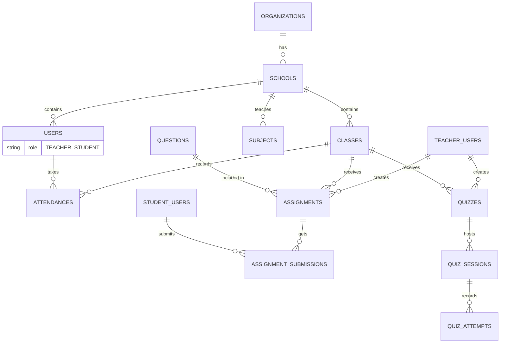

# Shiksha Sathi Database Schema

This document details the schema of the MongoDB database collections for Shiksha Sathi. It maps directly to the domain entities used in the Spring Boot backend (`com.shikshasathi.backend.core.domain`).

## Overview

**Database**: MongoDB (host: configured via `MONGODB_URI`)  
**Collections**: 12 core collections

## Entity-Relationship Diagram

## Base Entity

Almost all collections inherit standard auditing fields from `BaseEntity`:
- `created_at`: Timestamp of creation (Instant)
- `updated_at`: Timestamp of last update (Instant)
- `created_by`: ID of the user who created the record
- `updated_by`: ID of the user who last modified the record

---

## Collections

### `organizations`

Represents high-level organizational bodies (e.g., educational trusts, districts).

| Field | Type | Description |
|-------|------|-------------|
| `_id` | ObjectId | Primary key |
| `name` | String | Organization name |
| `address` | String | Main address |
| `contact_email` | String | Primary contact email |
| `is_active` | Boolean | Active status (default: true) |
| `created_at` | Instant | Creation timestamp |
| `updated_at` | Instant | Last update timestamp |

### `schools`

Represents individual schools under an organization.

| Field | Type | Description |
|-------|------|-------------|
| `_id` | ObjectId | Primary key |
| `organization_id` | String | Refers to Organization `_id` |
| `name` | String | School name |
| `address` | String | Location/address |
| `contact_email` | String | Administrative email |
| `is_active` | Boolean | Active status (default: true) |
| `created_at` | Instant | Creation timestamp |
| `updated_at` | Instant | Last update timestamp |

### `users`

Core user representation for authentication and identity.

| Field | Type | Description |
|-------|------|-------------|
| `_id` | ObjectId | Primary key |
| `name` | String | User's full name |
| `email` | String | Email address (unique) |
| `phone` | String | Phone number |
| `password_hash` | String | BCrypt hashed password |
| `role` | Enum | TEACHER, STUDENT |
| `school_id` | String | Refers to School `_id` |
| `school` | String | Denormalized school name |
| `roll_number` | String | Student roll number |
| `student_class` | String | Class level (e.g., "10") |
| `section` | String | Section/division (e.g., "A") |
| `birth_date` | String | Date of birth |
| `is_active` | Boolean | Account status (default: true) |
| `last_login_at` | Long | Last login timestamp (millis) |
| `created_at` | Instant | Creation timestamp |
| `updated_at` | Instant | Last update timestamp |

---

## School Management Collections

### `classes`

Represents a grouping of students (e.g., Class 10-A).

| Field | Type | Description |
|-------|------|-------------|
| `_id` | ObjectId | Primary key |
| `school_id` | String | Refers to School `_id` |
| `name` | String | Class name (e.g., "10A") |
| `section` | String | Section (e.g., "A") |
| `grade` | String | Grade level (e.g., "10") |
| `teacher_ids` | List[String] | Teacher user IDs |
| `student_ids` | List[String] | Enrolled student IDs |
| `is_active` | Boolean | Active status (default: true) |
| `created_at` | Instant | Creation timestamp |
| `updated_at` | Instant | Last update timestamp |

### `subjects`

Subjects taught in a school.

| Field | Type | Description |
|-------|------|-------------|
| `_id` | ObjectId | Primary key |
| `school_id` | String | Refers to School `_id` |
| `name` | String | Subject name (e.g., "Science") |
| `description` | String | Subject description |
| `is_active` | Boolean | Active status (default: true) |
| `created_at` | Instant | Creation timestamp |
| `updated_at` | Instant | Last update timestamp |

### `attendances`

Records of student attendance.

| Field | Type | Description |
|-------|------|-------------|
| `_id` | ObjectId | Primary key |
| `class_id` | String | Refers to Class `_id` |
| `student_id` | String | Refers to User `_id` |
| `date` | String | ISO date (YYYY-MM-DD) |
| `status` | String | PRESENT, ABSENT, LATE, EXCUSED |
| `created_at` | Instant | Creation timestamp |
| `updated_at` | Instant | Last update timestamp |

---

## Learning & Assessment Collections

### `questions`

A unified collection for both Canonical (source) and Derived (AI-generated) questions.

| Field | Type | Description |
|-------|------|-------------|
| `_id` | ObjectId | Primary key |
| `subject_id` | String | Subject reference |
| `chapter` | String | Chapter name |
| `topic` | String | Topic name |
| `text` | String | Question content |
| `type` | String | MULTIPLE_CHOICE, SHORT_ANSWER, ESSAY, FILL_IN_BLANKS, TRUE_FALSE |
| `options` | List[String] | MCQ options |
| `correct_answer` | String | Correct answer |
| `points` | Integer | Mark value |
| `explanation` | String | Answer explanation |
| `source_kind` | String | CANONICAL, DERIVED, EXEMPLAR |
| `review_status` | String | DRAFT, APPROVED, REJECTED, PUBLISHED |
| `provenance` | Object | Source metadata (board, class, book, chapterNumber, etc.) |
| `language` | String | Question language |
| `question_id` | String | Reference to canonical question (for exemplars) |
| `difficulty` | String | easy, medium, hard |
| `blooms_level` | String | remember, understand, apply, analyze, evaluate, create |
| `qa_flags` | List[String] | Quality assurance flags |
| `review_state` | String | approved, rejected |
| `source_pages` | List[Integer] | Source PDF page numbers |
| `source_canonical_question_ids` | List[String] | Parent question IDs (for derived) |
| `derived_from_chapter_id` | String | Chapter reference |
| `generation_run_id` | String | AI generation run ID |
| `generation_rationale` | String | AI generation rationale |
| `reviewer_notes` | String | Reviewer comments |
| `created_at` | Instant | Creation timestamp |
| `updated_at` | Instant | Last update timestamp |

### `assignments`

Tasks assigned to students.

| Field | Type | Description |
|-------|------|-------------|
| `_id` | ObjectId | Primary key |
| `title` | String | Assignment title |
| `description` | String | Assignment description |
| `subject_id` | String | Subject reference |
| `class_id` | String | Class reference |
| `teacher_id` | String | Teacher user ID |
| `question_ids` | List[String] | Included question IDs |
| `due_date` | Instant | Due date/time |
| `max_score` | Integer | Maximum score |
| `status` | String | DRAFT, PUBLISHED, CLOSED |
| `code` | String | 6-char alphanumeric join code |
| `created_at` | Instant | Creation timestamp |
| `updated_at` | Instant | Last update timestamp |

### `assignment_submissions`

Student submissions for assignments.

| Field | Type | Description |
|-------|------|-------------|
| `_id` | ObjectId | Primary key |
| `assignment_id` | String | Assignment reference |
| `student_id` | String | Student user ID |
| `student_name` | String | Student name |
| `student_roll_number` | String | Student roll number |
| `school` | String | School name |
| `student_class` | String | Class level |
| `section` | String | Section |
| `answers` | Map | Question ID → Student Answer |
| `score` | Integer | Awarded score |
| `submitted_at` | Instant | Submission timestamp |
| `status` | String | SUBMITTED, GRADED |
| `feedback_json` | String | AI-graded feedback (JSON) |
| `created_at` | Instant | Creation timestamp |
| `updated_at` | Instant | Last update timestamp |

### `quizzes`

Teacher-created quizzes.

| Field | Type | Description |
|-------|------|-------------|
| `_id` | ObjectId | Primary key |
| `teacher_id` | String | Teacher user ID |
| `class_id` | String | Class reference |
| `title` | String | Quiz title |
| `description` | String | Quiz description |
| `question_ids` | List[String] | Included question IDs |
| `question_points_map` | Map | Question ID ��� points |
| `time_per_question_sec` | Integer | Seconds per question |
| `self_paced_enabled` | Boolean | Self-paced mode enabled |
| `self_paced_code` | String | Code for self-paced access |
| `published_at` | Instant | Publish timestamp |
| `created_at` | Instant | Creation timestamp |
| `updated_at` | Instant | Last update timestamp |

### `quiz_sessions`

Live quiz session instances.

| Field | Type | Description |
|-------|------|-------------|
| `_id` | ObjectId | Primary key |
| `quiz_id` | String | Quiz reference |
| `teacher_id` | String | Teacher user ID |
| `class_id` | String | Class reference |
| `session_code` | String | Session join code |
| `status` | String | LOBBY, LIVE, REVEAL, ENDED |
| `current_question_index` | Integer | Current question position |
| `question_started_at` | Instant | Question start timestamp |
| `question_ends_at` | Instant | Question end timestamp |
| `locked` | Boolean | Session locked status |
| `ended_at` | Instant | Session end timestamp |
| `revision` | Long | State revision number |
| `created_at` | Instant | Creation timestamp |
| `updated_at` | Instant | Last update timestamp |

### `quiz_attempts`

Student quiz attempt records.

| Field | Type | Description |
|-------|------|-------------|
| `_id` | ObjectId | Primary key |
| `quiz_id` | String | Quiz reference |
| `student_id` | String | Student user ID |
| `started_at` | Instant | Attempt start timestamp |
| `submitted_at` | Instant | Submission timestamp |
| `answers` | Map | Question ID → Answer |
| `score` | Integer | Awarded score |
| `total_marks` | Integer | Total marks possible |
| `created_at` | Instant | Creation timestamp |
| `updated_at` | Instant | Last update timestamp |

### `analytics_events`

Usage tracking and event logging.

| Field | Type | Description |
|-------|------|-------------|
| `_id` | ObjectId | Primary key |
| `event` | String | Event type |
| `payload` | Map | Event details |
| `userAgent` | String | Client user agent |
| `userId` | String | User ID |
| `timestamp` | LocalDateTime | Event timestamp |

---

## Indexes

### `users` Collection
- `email` (unique)
- `phone`
- `role`
- `school_id`
- `student_class` + `section`

### `questions` Collection
- `subject_id`
- `chapter`
- `source_kind`
- `review_status`
- `provenance.board` + `provenance.class` + `provenance.subject`

### `assignments` Collection
- `class_id`
- `teacher_id`
- `status`
- `code` (unique)

### `assignment_submissions` Collection
- `assignment_id`
- `student_id`

### `quiz_sessions` Collection
- `session_code` (unique)
- `quiz_id`
- `status`

### `classes` Collection
- `school_id`
- `grade`
