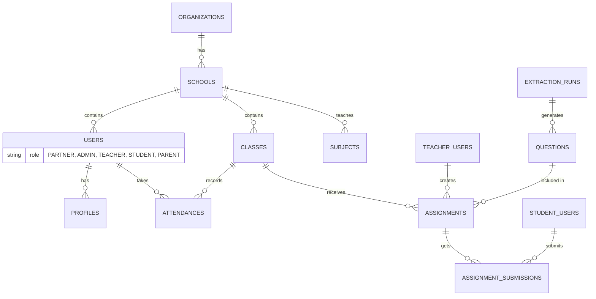

# Shiksha Sathi Database Schema

This document details the schema of the MongoDB database collections for Shiksha Sathi. It maps directly to the domain entities used in the Spring Boot backend (`com.shikshasathi.backend.core.domain`).

## Entity-Relationship Diagram

## Base Entity
Almost all collections inherit standard auditing fields from `BaseEntity`:
*   `created_at`: Timestamp of creation (Instant)
*   `updated_at`: Timestamp of last update (Instant)
*   `created_by`: ID of the user who created the record
*   `updated_by`: ID of the user who last modified the record

---

## Organizational & User Collections

### `organizations`
Represents high-level organizational bodies (e.g., educational trusts, districts).
*   `name` (String): Organization name.
*   `address` (String): Main address.
*   `contact_email` (String): Primary contact email.
*   `is_active` (Boolean): Active status.

### `schools`
Represents individual schools under an organization.
*   `organization_id` (String): Refers to Organization `_id`.
*   `name` (String): School name.
*   `address` (String): Location/address.
*   `contact_email` (String): Administrative email.
*   `is_active` (Boolean): Active status.

### `users`
Core user representation for authentication and identity.
*   `name` (String)
*   `email` (String)
*   `phone` (String)
*   `password_hash` (String)
*   `role` (Enum): `PARTNER`, `ADMIN`, `TEACHER`, `STUDENT`, `PARENT`
*   `school_id` (String): Refers to School `_id`.
*   `school` (String): Denormalized school name.
*   `roll_number` (String): Specifically for Students.
*   `student_class` (String): Class level/grade.
*   `section` (String): Section division.
*   `is_active` (Boolean)
*   `last_login_at` (Number/Milli)

### `profiles`
Detailed profile data (focused primarily on Teachers).
*   `user_id` (String): Refers to User `_id`.
*   `name` (String)
*   `school` (String)
*   `board` (String)

---

## School Management Collections

### `classes`
Represents a grouping of students.
*   `school_id` (String): Refers to School `_id`.
*   `name` (String): E.g., "Class 10A".
*   `section` (String): E.g., "A".
*   `grade` (String): The grade/standard (e.g., "10").
*   `teacher_ids` (List of Strings): Teachers assigned.
*   `student_ids` (List of Strings): Students enrolled.
*   `is_active` (Boolean)

### `subjects`
Subjects taught in a school.
*   `school_id` (String): Refers to School `_id`.
*   `name` (String): E.g., "Science".
*   `description` (String)
*   `is_active` (Boolean)

### `attendances`
Records of student attendance.
*   `class_id` (String): Refers to Class `_id`.
*   `student_id` (String): Refers to User `_id`.
*   `date` (String): ISO date format (YYYY-MM-DD).
*   `status` (String): `PRESENT`, `ABSENT`, `LATE`, `EXCUSED`

---

## Learning & Assessment Collections

### `questions`
A unified collection for both Canonical (source) and Derived (AI-generated) questions.
*   `subject_id` (String)
*   `chapter` (String)
*   `topic` (String)
*   `text` (String): The question content.
*   `type` (String): `MULTIPLE_CHOICE`, `SHORT_ANSWER`, `ESSAY`, `FILL_IN_BLANKS`, etc.
*   `options` (List of Strings): For MCQs.
*   `correct_answer` (String)
*   `points` (Integer)
*   `explanation` (String)
*   `source_kind` (String): `CANONICAL` or `DERIVED`.
*   `review_status` (String): `DRAFT`, `APPROVED`, `REJECTED`, `PUBLISHED`.
*   `language` (String)
*   `provenance` (Object):
    *   `extraction_run_id`, `board`, `class` (class level/grade), `subject`, `book`, `chapterNumber`, `chapterTitle`, `sourceFile`, `pageNumbers`, `section`.
*   **Derived-Specific Fields**:
    *   `source_canonical_question_ids` (List of Strings): Ancestry linking to canonical questions.
    *   `variation_type` (String): Type of variation.
    *   `difficulty_level` (String)
    *   `concept_tested` (String)
    *   `generation_metadata` (Map)

### `extraction_runs`
Logs of ingestion from source materials (e.g., PDFs).
*   `board` (String)
*   `class_level` (String)
*   `subject` (String)
*   `book` (String)
*   `chapter_number`/`chapter_title`
*   `version` (Integer)
*   `status` (String): `PENDING`, `COMPLETED`, `FAILED`, `APPROVED`
*   `source_file` (String)
*   `extraction_metadata` (Object)
*   `question_count` (Integer)

### `assignments`
Tasks given to students.
*   `title` (String), `description` (String)
*   `subject_id` (String), `class_id` (String)
*   `teacher_id` (String)
*   `question_ids` (List of Strings)
*   `due_date` (Instant)
*   `max_score` (Integer)
*   `status` (String): `DRAFT`, `PUBLISHED`, `CLOSED`
*   `code` (String): 6-char alphanumeric code for joining without explicit logins.

### `assignment_submissions`
Student submissions for an assignment.
*   `assignment_id` (String)
*   `student_id` (String)
*   `student_name` (String), `student_roll_number` (String), `school` (String), `student_class` (String), `section` (String)
*   `answers` (Map of Strings to Objects): Question ID resolving to the student's answer.
*   `score` (Integer)
*   `submitted_at` (Instant)
*   `status` (String): `SUBMITTED`, `GRADED`
*   `feedback` (String): AI-graded feedback stored as JSON string.

---

## Analytics
### `analytics_events`
Usage tracking and event logging.
*   `event` (String): Type of event.
*   `payload` (Map of Strings to Objects): Event details.
*   `userAgent` (String)
*   `userId` (String)
*   `timestamp` (LocalDateTime)
